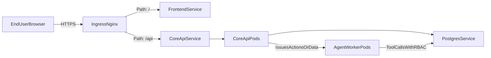

# Architecture Description

EsportAtlas uses Service-Oriented Architecture to separate interactive API traffic from asynchronous autonomous processing.

## Runtime Components

- `frontend` (React SPA): user/admin interfaces with lazy route loading.
- `core-api` (Node.js + Express): auth, RBAC-protected REST, and data retrieval.
- `agent-worker` (Node.js): autonomous tool-calling engine for operational actions.
- `postgres`: single relational data store in 3NF schema.

## Data Flow

## Clean Architecture in Core API

- `api/`: route and schema boundaries.
- `controllers/`: HTTP adaptation layer.
- `services/`: business logic and orchestration.
- `repositories/`: persistence layer.
- `middleware/`: auth, RBAC, validation, error handling.

## Agent Worker Behavior

- Reads an action queue payload (bootstrap source in env for scaffold).
- Selects registered tools by `tool` name.
- Checks role privileges before execution.
- Executes DB-backed action for CRUD/admin automation/suggestions.
- Emits execution logs for observability and future queue integration.

## Kubernetes Strategy

- Per-service Deployments with ClusterIP Services.
- Ingress for frontend/API exposure.
- HPA for `agent-worker` to scale asynchronous throughput.
- Secret-backed sensitive env variables (`DATABASE_URL`, `JWT_SECRET`).
